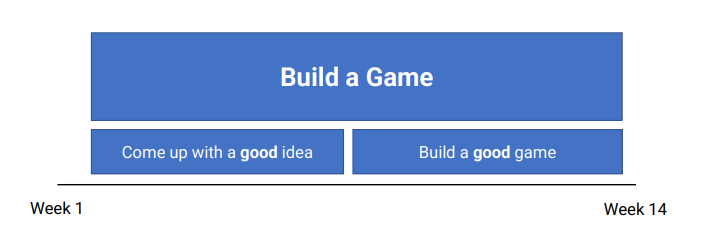

# Lecture 2: Project Launch and Game Design

## Assignment 1

### Structure

### Theme
Build a `simple, but eerier game`.

Your creation should evoke a sense of `unease`, `facination`, drawing players into a `surreal` and `spooky` atmosphere.

It should `steer clear` of cliche horror tropes like zombies or "slendermen" games.

You should strive to `challenge conentional gameplay` mechanics by incorporating creative elements that are bizarre, yet captivating.

### Requirements
* Eerie atmosphere
* 10 minutes
> That is all main mechanics displayed in the first 10 minutes. Game could actually go on for hours if need be.
* Single Player
* WebGL
* Unity 2022 LTS

For assignment 1, produce a `Game Design Document` (GDD) and an `Initial Prototype`

### Game Design Document
In modern times, GDDs are `concise`, `ever-evolving` and `media-rich`.

They capture all the `design decisions` you make when designing your game.

### Proof-of-concept game
A prototype that should `reflect the GDD` and show that the game is `feasible`

It is:
* NOT expected to be polished
* NOT expected to be fully functional

### Initial Prototype
So, what does "eerie worlds" mean?

* Bizarre
* Spooky
* Strange
* Uneasy
* Suspenseful
* Mystical
* Mysterious
* Uncanny
* Fascinating

Not Horror

## Design Thinking
