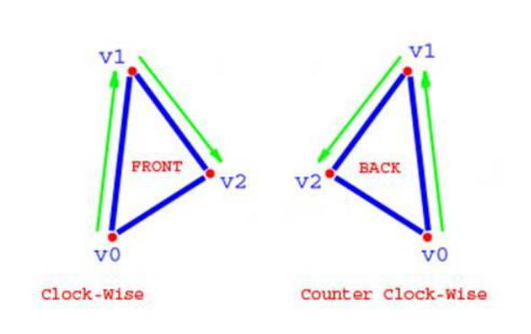

# Workshop 2: Polygonal Geometry
> How do we represent 3D objects in a scene?

## Meshes

Meshes are collections `collection of triangles`

## Front / Back Faces
* So a triangle is defined by 3 vertices (points)
* What defines which side the 'front' of the triangle is?
* Vertices defined in a `clock-wise order` creates a 'front-facing' triangle.
* Order is relative to the `point of view of the camera`
> But why do we care which side is the front and which side is the back

## Culling
We usually `cull` back faces. Most objects are closed, so there is `no point in rendering the back` (internal faces)