# Lecture 3: Rendering Pipeline

## Graphics Programming
* Pretty much all graphics applications are built on `Direct3D (windows)` or `OpenGL (most other platforms)`
* Modern PC graphics cards will support some version of both APIs
* The native versions of these APIs can be a bit `low-level` and terrifying to actually use
  * Engines `(like unity)` build upon those APIs to `make development easier`. But they'll still `allow for lower level involvement when you want to`

We can represent any polyhedron as triangles

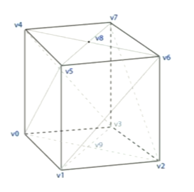

## Graphics Pipelining
* Both OpenGL and Direct3D have a pipeline, involving `multiple different stages`
* Breaks the process of putting things on a screen  down into different steps to `improve efficiency` and let programmers `optimize tasks` into different steps

## Direct3D Pipeline

### Primitive Types
This is the `building block stage` that gets data into the pipeline

Primarily, we would use triangles but `other options exist`

**`Adjacencies`**, allow us to `tell the pipeline about neighboring vertices` - this can be useful for silhouettes, shadows, etc. This information would be used by the geometry shader only

>Important triangles with adjacencies lead to double the number of vertices

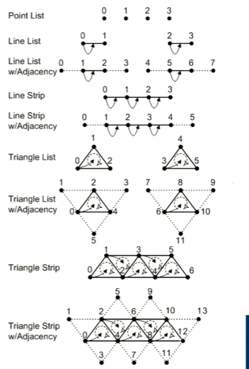

> Winding order of triangles is **`extremely important`**

If you have the triangles render `clockwise`, you're telling it that `this is the front`

If you have the triangles render `counter-clockwise`, you're telling it that `this is the back`

> This causes triangles to not be rendered because you're telling the engine that this `shape is facing away from the view` and hence won't be rendered to save memory

### Vertex Shader
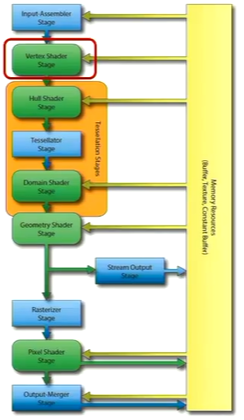

Objects are typically created in their `local spaces`. We need to bring them into the `common world space`, via a series of `affine transforms` (translation, rotation and scaling)

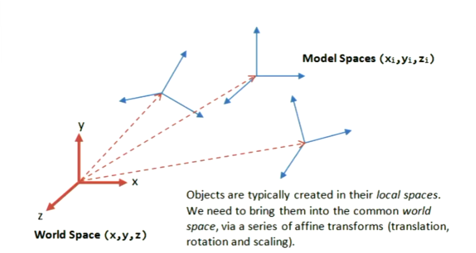

### Tesselation
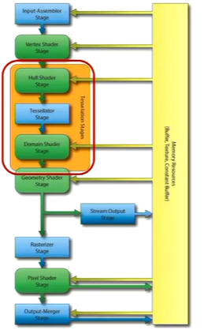

This stage adds triangles programatically and handles adding detail to models

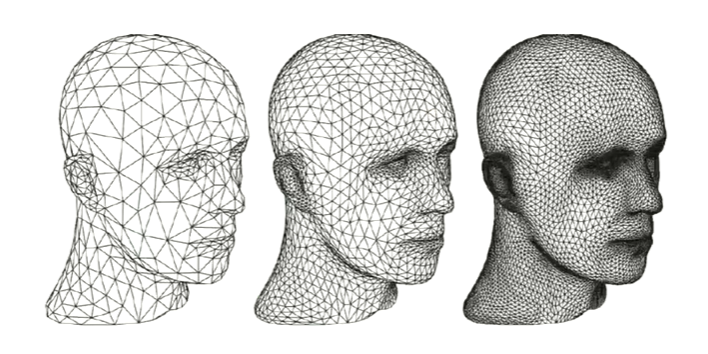

### Geometry Shader
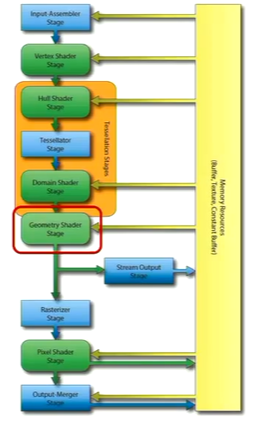

Doing stuff with the triangles you already have not the vertices.

In this stage if you want to a particle system, hair, fur, etc

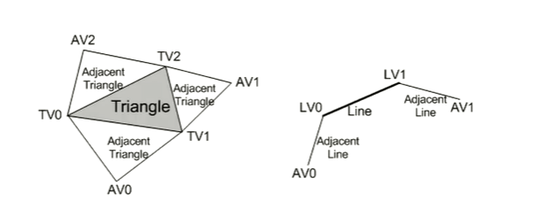

### Stream Output Stage

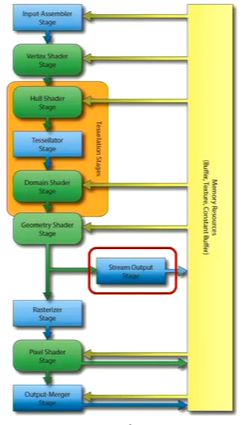

### Rasterizer - to pixels

Where as before you could only perform operations on the triangles and their vertices, now you can `perform operations on the individual pixels`

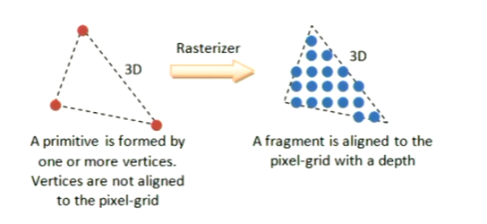

### Culling
* Don't bother rendering pixels that people won't see - 'cull' them
* Triangles facing away from the camera will be culled and not displayed
* Only things in the vision of user get rendered

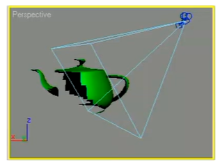

### Double Buffering - aside
* Don't completely draw directly to the screen! The screen could update before the new frame is completely drawn!
  * If you don't could result in `screen tearing` (remember that lol?)
* So, stick your next frame in a buffer, then swap.

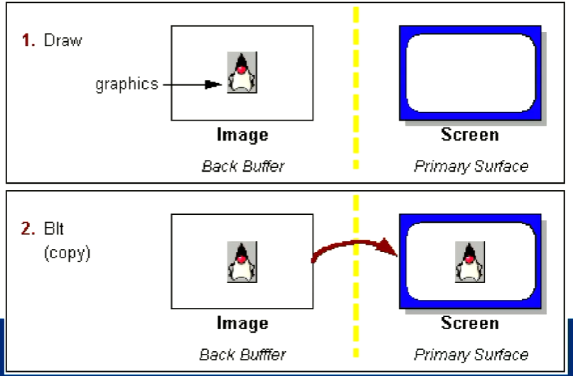

### Pixel Shader

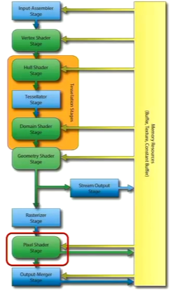

# Part 2: Rasterising and Ray Tracing

## Rasterising

### Basics Algorithm

* `Loop` through all the objects in your scene:
  * Convert vertices to camera space (with perspective projection)
  * `Loop` through all pixels in the scene:
    * `If` pixels are within the projected triangle:
      * `pixels = triangle's colour`

This is `extremely inefficient`

## Ray Tracing

### Basic Algorithm

* `Loop` through each pixel in your output image:
  * Shoot a ray from the center of the camera through that pixel
  * `Loop` through all objects in the scene:
    * Does that ray intersect with that object?
    * `If` it intersects:
      * `pixel's colour = objects colour`

## Ray Tracing vs Rasterising

At this point, with both techniques we have drawn a basic triangle to the camera

With ray tracing, we've only had to visit `each pixel once`. With rasterizing, we've only had to visit `each object once`.

For now, for all intensive purposes, the 2 techniques are pretty much the same

> Obviously, they scale differently, depending on canvas size, number of objects in the scene, etc

However, realistically, the graphical richness comes from `the lighting` of a scene rather than the number of polygons.
> This is where `ray tracing >>>> rasterisation`