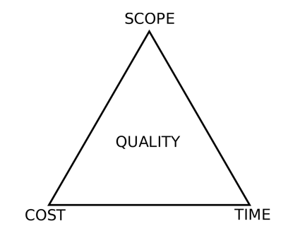
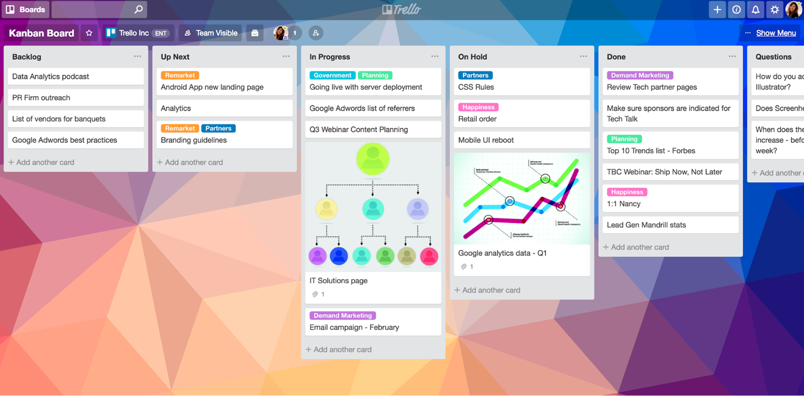
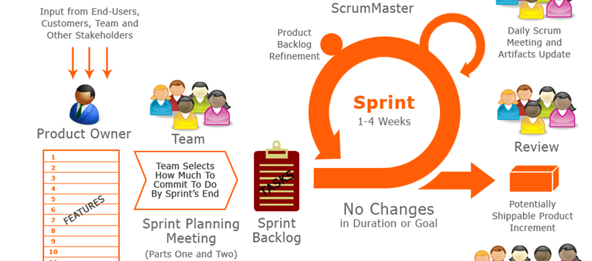
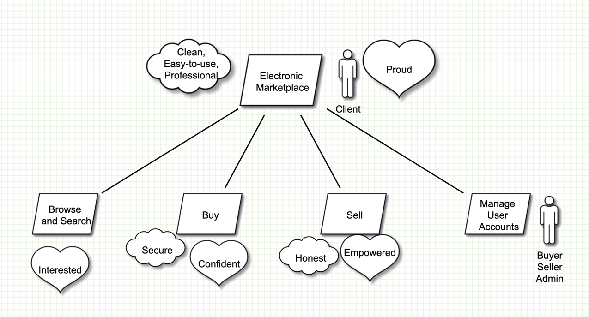
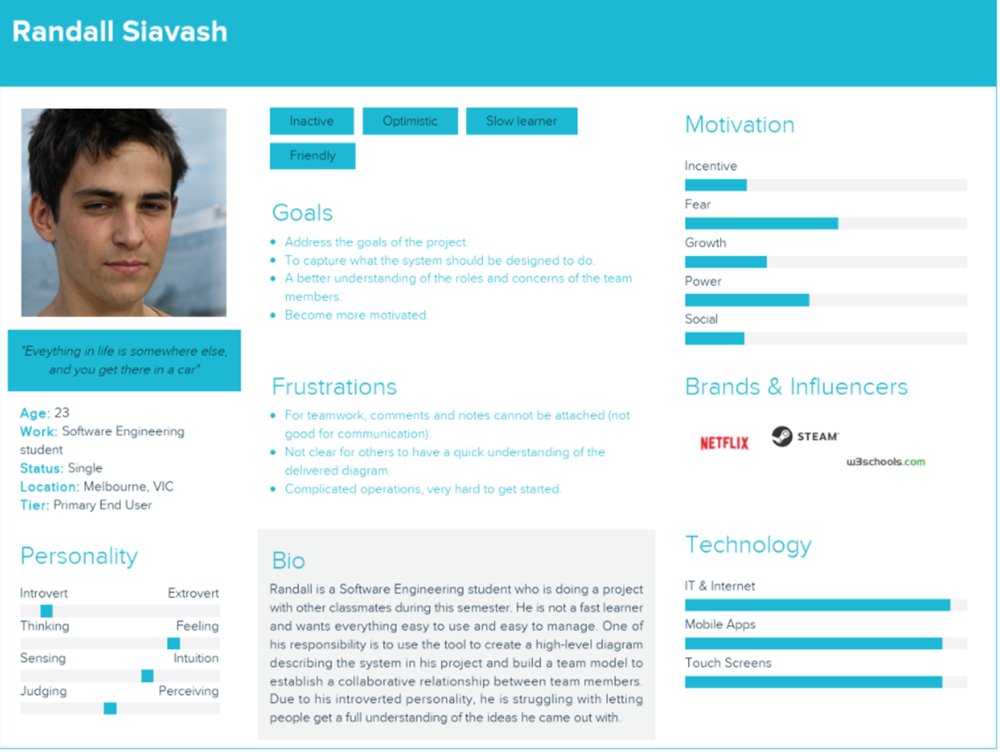

# Lecture 2: Intro to Agile Requirements

## What is a project?
A temporary endeavor to create a unique product, service or result

## Approaches To Software Development

Requirements $\rightarrow$ Design $\rightarrow$ Execution $\rightarrow$ Testing $\rightarrow$ Release

`Agile methods` evolved around the 2000s to address `project issues`, `change emphasis`, and make `less document heavy`

## Agile Methods
* Many methods
  * Extreme Programming (XP), Kanban Boards, Scrum

* Agile methods are used broadly in society
* Outcome of the subject $-$ practical, not theoretical
* Explained in workshops

## Clients
* Clients are an important component of this subject
* Project `must meet their needs`
  * However, needs `may not be clear`

## Requirements

### Issues
`Inception:`
* What is to be built?
How to elicit client wants and needs?
* How to document client requests?

`Conclusion:`
* When is it complete?
  * If no agreement then there may be legal disputes
* Appreciate this new territory for most

### Types
* Functional requirements
* Quality (Non-functional) requirements
  * Security, scalability, portability, maintainability
  * Ease of use
  * Performance requirements
  Emotional requirements

### User Stories
* Common approach in agile development
* __User stories__ are `short, simple descriptions` of a feature told from the `perspective of the person who desires the new capability`, usually a user or customer of the system
* _As a `<type of user>` i want `<some goal>` so that `<some reason>`_

#### Example User Story
`Epic:` Buy, sell, search real estate properties, proudly and easy to use, clean, professional manner

`US1:` As a buyer, I want to be able to browse and search properties, and remain interested through the process.

`US2:` As a buyer, I want to also be able to:
1. Look up items using keywords
2. Browse listings
3. Lookup a seller account
4. Contact a seller
5. Create an account
6. Login and logout
7. Edit details

## Expectations For This Subject
* Build a requirements document encompassing functional and quality requirements
  * `user stories recommended`
  * `prioritisation recommended`
* Do/be/feel method for elicitation suggested to develop an agreed (motivational) with your client
* As appropriate, check consistency between user stories and motivational model
* At the end of the sprint, check whether the model still accurately captures your understanding

## Motivational Modelling
* A method to understand a problem is easy to connect with requirements and designs
* Based on research in agent-oriented software engineering and influenced by design thinking
* Deceptively simple
* Useful process
* Grew out of use case models
* Grew out of use case models
* Focus on emotions and design thinking

A simple motivational model:

Model from team in 2022

## Personas 
> A way of depicting a typical client

Comes from Human-Computer Interaction and understanding the customer

> A tool to create these is `Xtensio`

## Summary About Requirements
* `Documented requirements` are required for your project
* Be `realistic`
* Requirents need to be `approved by the client`
* Client interactions intended to be positive, productive and lightweight
* Motivational modelling to `share understanding of the problem` to be solved with a client
* Connects well with `personas and user stories`
* Recommended, but not mandated