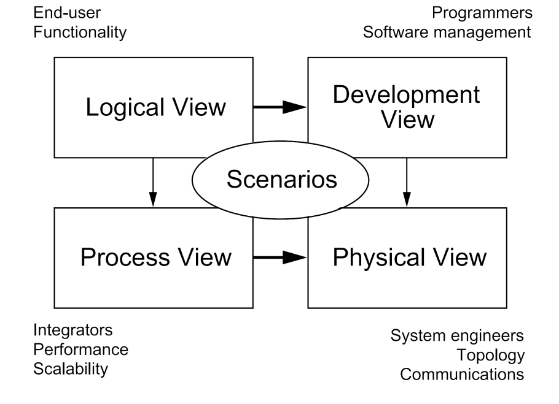
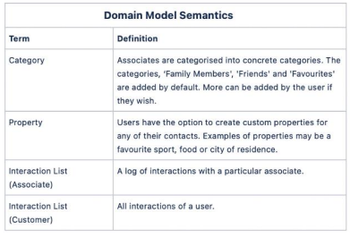
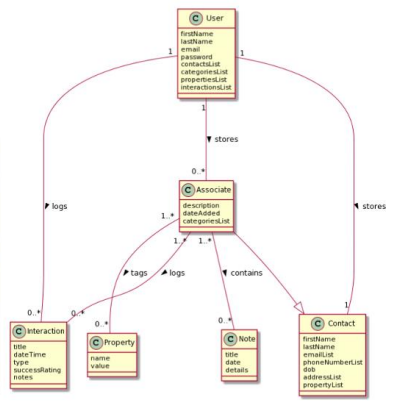

# Lecture 3: Design

* Architectural Design
* 4 + 1 Architecture Model
* Front-end Design
* Low & high fidelity prototypes

## Design
* A communication exercise so people can understand your code (and thinking)
* No prescribed method
* UI design (client involvement will vary)
  * Plenty of templates: Figma, Canva ...
  * Wireframes, Low fidelity prototypes
* High level architecture
* Detailed architecture

## High-level architecture
* Fro Web apps: A front-end, a back-end, and integration
* Front end concerns the UI
* Back end concerns storing and retrieving data

## 4 + 1 Architecture Model
* Common Model for documenting software architecture
* Originally developed by kruchten in 1995
* Defines a set of views, relevant to different stakeholders
* Makes it easier to understand what is needed

## Logical View
* Describes the functional requirements of the system
* Shows the components of the system and their relationships
* Includes domain, class and database diagrams

## Domain Model

