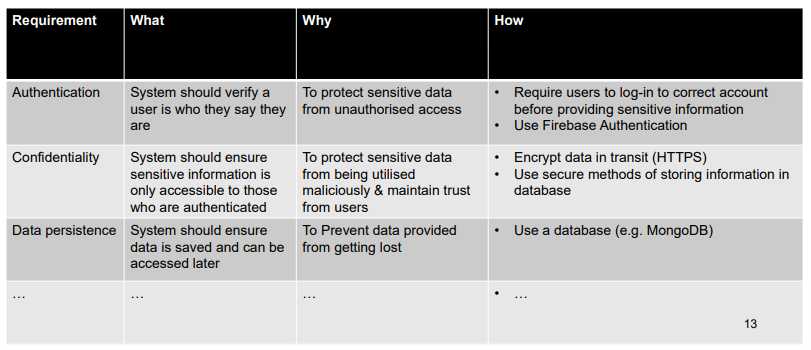
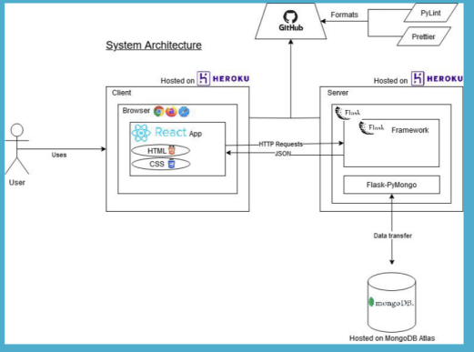

# Lecture 3: Design

* Architectural Design
* 4 + 1 Architecture Model
* Front-end Design
* Low & high fidelity prototypes

## Design
* A communication exercise so people can understand your code (and thinking)
* No prescribed method
* UI design (client involvement will vary)
  * Plenty of templates: Figma, Canva ...
  * Wireframes, Low fidelity prototypes
* High level architecture
* Detailed architecture

## High-level architecture
* Fro Web apps: A front-end, a back-end, and integration
* Front end concerns the UI
* Back end concerns storing and retrieving data

## 4 + 1 Architecture Model
* Common Model for documenting software architecture
* Originally developed by kruchten in 1995
* Defines a set of views, relevant to different stakeholders
* Makes it easier to understand what is needed

## Logical View
* Describes the functional requirements of the system
* Shows the components of the system and their relationships
* Includes domain, class and database diagrams

## Domain Model

## Database Model
* Provides a visualisation of database setup, e.g. with MongoDB
* Consider authentication, etc

## Process View
* Deals with dynamic aspects of the system
* Explains system processes and how they communicate
* Focuses on runtime behaviour of the system
* Includes sequence state diagrams

## Deployment View
* Represented by package diagram
* Includes illustration from programmers perspective
* Can describe architecture goals and constraints, system diagrams, API descriptions, etc...

## Architecture Goals & Constraints

## System Diagram

## Physical View
* Depicts the system from an engineer's point of view
* Concerned with the topology of software components at the physical layer, as well as the physical connection between these components
* Represented using the deployment diagram

## Deployment Pipeline
Example

## Architecture Diagram

> Something like this would be good

## Frontend Design

### Low Fidelity Prototypes
* Quick and easy way to make sure interface is fit-for-purpose
* Only includes basic aspects of visual design (e.g. shapes of elements)
* Only includes key elements
* No final colours, visual elements, etc...
* Test interaction with users

### High Fidelity Prototypes
* Appear as similar as possible to actual product
* Develop after you have a more solid understanding
* Include realistic content, visual design, colours, etc...
* Realistic interactions

### Design in COMP30022
* Think about who you need to communicate with
* Think about what needs to be documented
* Review important documents with your team
* Use them to identify flaws in your design
* Keep them up to date
* Tools like Figma, Marvel are good for prototyping