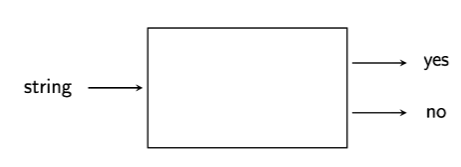

# Lecture 1
## Goals
* Clearly and precisely explain complicated code
* Optimize some code without breaking it
* Write a technical specification
* Parse some text
* Work with asynchronous systems

> Logic and automa theory are __irreplaceable__ for getting these right

## Topic: Informal Proof
The writing of mathematical arguments
> We require logical reasoning to use these tools described later in the subject

## Topic: Formal Logic
Check proofs __algorithmically__

Informal proofs are written in natural language:
```
"P implies Q, and P holds. Therefore Q holds"
```

Formal proofs are more like code:
```
# Write in example from early lecture slide
```

## Topic: Automa Theory
Study various idealized computing machines
* How they work
* What they can do (computability theory)
* Proving elementary properties

## Topic: Formal Language Theory
Study of sets of strings

Very close connection to automata theory
> What kinds of grammars correspond to what types of __automata__?

## Concept: Automaton
Idealized computing machines are called __automata__

Most types of automata just read a string and output `yes` or `no`



## Concept: Formal Language
A __(formal) language__ is a set of strings

```
{ab, aabb, aaabbbb, aaaabbbb, ...}
```
> Set of strings in which we can have many strings and each string is an equal number of `a` and `b` at the front and back

In this context we classify languages by:
* The sorts of rules (grammars) that __generate__ them
* The types of machines (automata) which can __recognize__ or __decide__ them.

## What is a Proof
A __deductive__ argument for a statement

> Mathematicians work with deductive arguments in which they go from the __`general to the specific`__

> A __deductive argument__ would __`not`__ look at 100 examples and conclude that there are millions or an infinite number `(this is specific to general which is wrong)`

Conclusion must follow from the premises __unconditionally__

> A mathematical proof `guarantees it's conclusion from the premises`

## Informal Proofs

### Example
Suppose that all philosophers are rabbits, and that Socrates is a philosopher. Then, Socrates is a rabbit

> It is valid from these premises to conclude that `socrates is a rabbit`

## Formal Proofs
More like computer code

1. $\forall \times (Philosopher(x) \rightarrow Rabbit(x))\space\space$ `(premise)`
2. $Philosopher(Socrates) \space \space$ `(premise)`
3. $Philosopher(Socrates) \rightarrow Rabbit(Socrates) \space \space$ `(UI 1)`
4. $Rabbit(Socrates) \space \space$ `(MP 3, 2)`

> __`UI`__ is __Universal Instantiation__

> __`MP`__ is __Modus ponens__ which is essentially the `if then rule`

## Direct Proof

### Theorem
$n^2$ is even for all even integers $n$

### Proof
Let $n$ be an even integer
> $n$ is established as an integer 

Then $n = 2k$ __for some__ integer $k$ by definition.
> Because any integer $k$ multiplied by $2$ is an even integer $n$

Squaring both sides and rearranging, we get

$n^2=(2k)^2=4k^2=2 \times 2k^2$

Since $k$ is an integer, so is $2k^2$.

Therefore $n^2$ is even by definition.

## Proof By Contradiction

## Theorem
$2n+1$ is not even for any integer $n$

## Proof
Let $n$ be an integer, and __suppose to the contrary__ that $2n+ 1$ is even.
> We bet that this is false

Then $2n+1=2k$ for some integer $k$ by definition.
> Essentially assume that the statement is true

Rearranging, we get $2k-2n=1$, and thus $k-n= \dfrac{1}{2}$.

But since $k$ and $n$ are integers, $k-n$ must also be an integer.
> Contradiction!!!!

Hence $2n+1$ is not even

## Proof By Induction

### Motivation
> Variation of direct proof

Suppose you know the following two things:

1. $0$ is purple
2. If an integer $n$ is purple, then $n+1$ is also purple.

Prove that 3 is purple

### Step By Step
1. $0$ is purple.  `(premise)`
2. If an integer $n$ is purple, then $n+1$ is also purple. `(premise)`
3. If $0$ is purple, then $1$ is purple `(universal instantiation, from 2)`
4. $1$ is purple. `(modus ponens, from 3 and 1)`
5. If $1$ is purple, then $2$ is purple. `(universal instantiation, from 2)`
6. $2$ is purple. `(modus ponens, from 5 and 4)`
7. If $2$ is purple, then $3$ is purple. `(universal instantiation from 2)`
8. $3$ is purple. `(modus ponens, from 7 and 6)`
> If we now consider the question: `how far can we keep doing this?`

> You would think infinitely because from the information we are given, it is reasonable to assume that every next integer will be purple forever.

> To `generalize to the statement` that every next number is purple we `need something more`

> We `cannot prove` that all integers are purple

## Axiom Schema of Induction
Let $P$ be a property. If these two statements hold:

* $P$ holds of $0$.
* For all $n \in \mathbb{N}$, if $P$ holds of $n$, then it holds of $n+1$

Then $P$ holds for all $n \in \mathbb{N}$.

> In english this basically translates to __`if we can get to any particular point, we can get to any point`__

