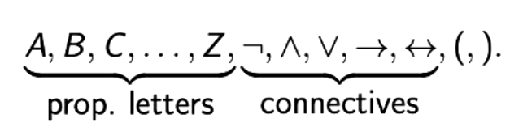

# Lecture 2: Propositional Logic
Propositional = Boolean Logic
> Yes as in `true` / `false` and `1` / `0` :DDDDDDD

## Intro Puzzle
Heidi, Dina and Louise are being questioned by their aunt.

Here is what they say:

* _Heidi: "Dina and Louise had equal share in it; if one is guilty, so is the other."_
* _Dina: "If Heidi is guilty, then so am I."_
* _Louise: "Dina and I are both not guilty"_

Their aunt, knows they are honest kids, and realises that they cannot tell a lie.

Has she got sufficient information to decide who (if any) are guilty?

### Answer
If we take a look at `Louise's` statement and make it less confusing, we understand that `Louise and Dina can't both be guilty at the same time`. Only one of Louise and Dina can be guilty

Now if we look at `Heidi's` statement, we see that she says Dina and Louise `have the same level of guilt`

That essentially means that the only way for these statements to hold true (Kids to be telling the truth) is that `Louise and Dina are both not guilty`

> `If you tried the contrary` and made one of Dina and Louise guilty it would invalidate Heidi's statement which is impossible because none of the children can be wrong (lie)

Hence we can conclude that `Heidi is also not guilty`
> If Heidi was guilty, Dina would also be guilty which we know to be false. If Heidi was guilty it would be impossible because it would mean that Dina is lying which is again `impossible`.

TLDR: No-one is guilty yay!!!! :DDDDDDDDDDDDDD

## Syntax
We shall build propositional formulas from this set of symbols:

Well-formed formulas are generated utilising this grammar:

wff $:=A \mid B \mid C \mid ... \mid Z$

$\mid \neg$ wff

$\mid($ wff $\wedge$ wff $)$

$\mid($ wff $\vee$ wff $)$

$\mid($ wff $\rightarrow$ wff $)$

$\mid($ wff $\leftrightarrow$ wff $)$

> `wff` can can be different each side

### Examples of Well-Formed Formula
* $P$ `P`
* $(P \rightarrow Q)$ `P implies Q`
* $(P \vee \neg P)$ `P or not P`
* $\neg (P \wedge \neg P)$ `not P and not P`
* $(P \leftrightarrow \neg P)$ `P if and only if not P`
* $(((P \rightarrow Q) \rightarrow P) \rightarrow P)$ `P implies Q implies P all implies P`

### Pronunciation Guide
The following symbols `do not carry the same meaning as the pronunciation would`

| Symbol | Pronunciation |
| --- | --- |
| $\neg$ | `not` |
| $\vee$ | `or; vee` |
| $\wedge$ | `and; wedge` |
| $\rightarrow$ | `if ... then; implies; only if; arrow` |
| $\leftrightarrow$ | `if and only if; biimplies; double arrow` |

> These symbols are __not__ shorthands for English words!

### Notational Conveniences
For sake of readability, we follow these __informal__ rules:

* Drop outermost parentheses
* Drop inner parentheses in nested uses of $\wedge$ and $\vee$
  * $P \wedge Q \wedge R$ is short for either of:
    * $((P \wedge Q) \wedge R)$
    * $(P \wedge (Q \wedge R))$
  * Same holds true when replacing every "$\wedge$" with "$\vee$"
  * __WARNING:__ $P \wedge Q \vee R$ is nonsense

### Well-Formed Formula According To Youtube Man
> [As seen in the Video `1.2 well-formed formulas` by Matthew Towers](https://www.youtube.com/watch?v=aAUDGmqAwa0) 

A collection of symbols is a WFF `if and only if it can be made using the following rules`:

1. A propositional variable `IS` itself a WFF.
> These -> $A \mid B \mid C \mid ... \mid Z$
2. If $\phi$ and $\psi$ are any two WFFs then:
    * $(\phi \wedge \psi)$ is a WFF
    * $(\phi \vee \psi)$ is a WFF
    * $(\phi \rightarrow \psi)$ is a WFF
    * $(\phi \leftrightarrow \psi)$ is a WFF
    * $\neg\phi$ is a WFF

## Truth Tables
> [A handy tool for `generating simple Truth Tables` using `propositional logic formulas`](https://web.stanford.edu/class/cs103/tools/truth-table-tool/)