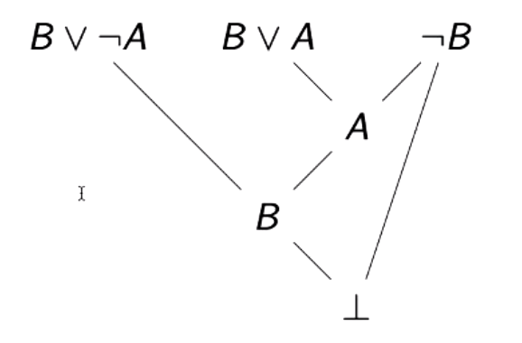
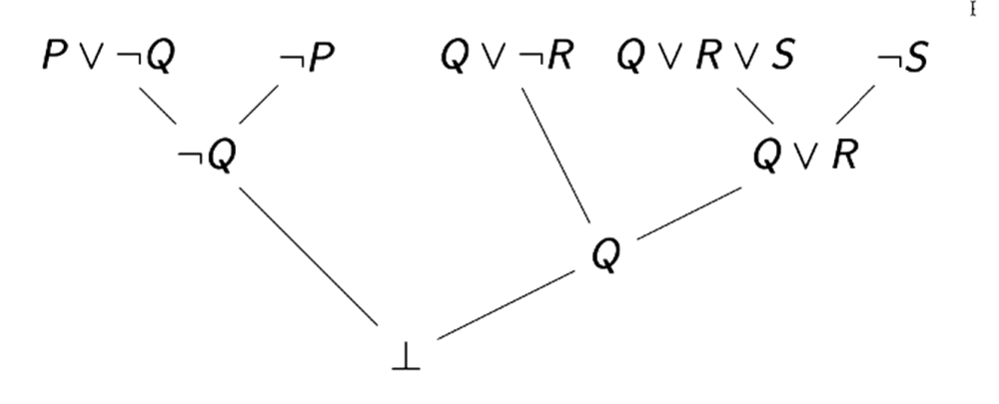
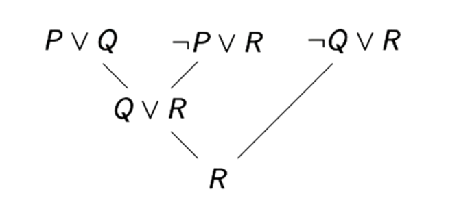

# Lecture 4: Resolution
> Propositional Logic is Decidable

Valid / contingent / unsatisfiable? Decide using truth tables

Finite but get `exponentially bigger`

$2^n$ rows for $n$ number of variables

## Resolution Graph Example

Graphical representation of proof:

A `refutation` of $(B \vee \neg A) \wedge (B \vee A) \wedge \neg B$

## How to Use Refutations
To show that $F$ is `valid`, refute $\neg F$

`Theorem:`

$\models F$ iff $\neg F \models \perp$

To prove $F \models G$, refute $F \wedge \neg G$.

$F \models G$ iff $F \wedge G \models \perp$

## Resolution Proof Exercises
> A way to think of these exercises is as if you are cancelling out opposing signs
Refute:

Derive $R$ from the premises:

## Do Not Do This, Please
__`Do not` cancel `multiple` letters at once!__

$(P \vee Q) \wedge (\neg P \vee \neg Q)$ __is `satisfiable`__

If you could cancel multiple at once the result of above would be $\perp$ `(unsatisfiable)`

## Formal Propositional Resolution

A resolution proof of $C_m$ from wffs $P_1, ..., P_n$ is a `string` of the form

$P_1, ..., P_n \vdash C_1, ..., C_m$

where each $C_i$ is either a `copy` of some $P_j$, or otherwise follows by `resolution` from any two wffs `earlier in the string`.

### Examples
* "$P \vdash P$"
* "$P , \neg P \vdash \bot$"
* "$(P \vee Q), \neg P \vdash Q$"

## Resolution System is Sound
$\models$ means __`semantically entails`__

$\vdash$ means __`syntactically entails`__

We write "$\Sigma \vdash_R F$" to mean "there is a resolution proof of $F$ from the set of premises $\Sigma$"
> subscript $R$ to denote it's a `proof in the resolution system`

`Theorem (Soundness):`

If $\Sigma \vdash_R F$, then $\Sigma \models F$

`Proof (Sketch):`

Let $x$ be a proof of $F$ from $\Sigma$.

Let $v$ be a model of $\Sigma$

Let $C_1, ..., C_n$ be the wffs after the $\vdash$ in $x$

Prove by induction that $v$ satisfies each $C_i$

## Conjunctive Normal Form (CNF)
In order to use resolution, we need formulas to be in a particular shape `(disjunctions)`

`Literal:` A propositional letter or its negation

`(Disjunctive) clause:` Disjunction $(V)$ of literals

`CNF:` conjunction $(\wedge)$ of disjunctive clauses.
> Conjunction of disjunctions of literals

AKA `product-of-sums` form.

`Example:` $(A \vee \neg B) \wedge (B \vee C \vee D) \wedge A$
> This formula is in CNF

`Theorem:` Every formula has at least one CNF
> So you can `convert every formula to an equivalent formula in CNF`

## From Negation Normal Form (NNF) to CNF

`NNF:` Only connectives are $\neg$, $\wedge$ and $\vee$. $\neg$ only in front of variables

`Example:` $(\neg A \vee (B \wedge \neg C)) \vee (C \wedge (B \vee D))$

To get NNF
1. Eliminate $\leftrightarrow$ (rewrite using $\rightarrow$ and $\wedge$).
2. Eliminate $\rightarrow$ (rewrite using $\vee$ and $\neg$).
3. Push $\neg$ inward (use de Morgan's laws).
4. Eliminate $\neg \neg$.
> __`Go to lecture 3 to see about these substitutions`__

To get CNF from NNF, distribute $\vee$ over $\wedge$.

### Example Conversion to CNF

$(\neg P \wedge (\neg Q \rightarrow R)) \leftrightarrow S$

$((\ P \wedge (\neg Q \rightarrow R)) \rightarrow S) \wedge (S \rightarrow (\neg P \wedge ( \neg Q \rightarrow R)))$

$(\neg (\neg P \wedge (\neg Q \rightarrow R)) \vee S) \wedge (\neg S \vee (\neg P \wedge (\neg Q \rightarrow R)))$

$NEED \space TO \space CONTINUE$