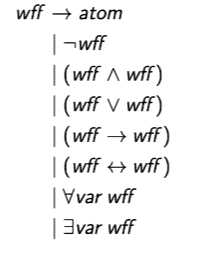

# Lecture 7: Predicate Logic

## Simplifying CNF

Common redundancies:
* Duplicate letters (e.g. $P \vee P$)
* Tautologies (e.g. $P \vee \neg P \vee Q$)
* Subsumptions (e.g. $(P \vee \neg Q \vee R) \wedge (P \vee R)$)

### Exercise: Simplify the formula:

$(P \vee P) \wedge (P \vee \neg P \vee Q) \wedge (P \vee \neg Q \vee R) \wedge (P \vee R)$

> Note that CNF is __`not unique`__

## Clausal Form

Represent CNF as a set of sets of literals

### Example

CNF:

$(P \vee \neg Q \vee S) \wedge (P \vee \neg R \vee S) \wedge (\neg S \vee \neg P) \wedge (\neg S \vee Q \vee R)$

__`Clausal form:`__ $\{\{P, S, \neg Q\}, \{P, S, \neg R\}, \{\neg P \neg S\}, \{Q, R, \neg S\}\}, $

We often treat these __`interchangeably`__

__`Why?`__ Simplifies reasoning

## Empty Disjunction

Let $A$ and $B$ be propositional letters.

* $\{A, B\}$ represents the clause $A \vee B$
* $\{A\}$ represents the clause $A$

What __`disjunctive clause`__ does $\emptyset$ represent

__`Natural choice:`__ $\bot$

Disjunction is true if `at least one` disjunct is true.

## Empty Conjunction

Let $C_1$ and $C_2$ be clauses.

* $\{C_1, C_2\}$ represents the CNF formula $C_1 \ C_2$

* $\{C_1\}$ represents the CNF $C_1$

What __`CNF`__ does $\emptyset$ represent?

__`Natural Choice:`__ $\bot$

Conjunction is true iff `every` conjunct is true.

## Empty Clauses and Formulas

* Empty conjunction $(\wedge)$ is `valid`
* Empty disjunction $(\vee)$ is `unsatisfiable`

Thus:

* The set of $\emptyset$ of clauses is `valid`
* Any set $\{\emptyset, ...\}$ clauses is `unsatisfiable`

Note that $\{\emptyset\} \neq \emptyset$

__`REMEMBER THE DIFFERENCE!`__

## Propositional Resolution for Clausal Form

Let $P$ be a propositional letter.

Let $C_1, C_2$ be clauses without $P$ or $\neg P$

$C_1 \cup \{P\}$

$c_2 \cup \{\neg P\}$

$C_1 \cup C_2$

## Why Predicate Logic?

Express statements about objects more faithfully

In particular, __finitely__ express:

* Statements about `infinite` collections (e.g. the integers)
* Transitive verbs (e.g. "loves") and relative pronouns (e.g. "whose")

## Some Translations

No emus fly: $\forall \times (Emu(x) \rightarrow \neg Flies(x))$

There are black swans: $\exists\times (Black(x) \wedge Swan(x))$

If all push the cart, the donkey will be happy: $(\forall \times P(x, c)) \rightarrow H(d)$

If the cart is pushed, the donkey will be happy: $(\forall \times P(x, c)) \rightarrow H(d)$

## Buildings Blocks

Five new kinds of symbols:

1. constants (e.g. for "`the` cart", d for "`the` donkey")

2. predicates (e.g. $P$ for "\_\_\_ is pushing \_\_\_", $H$ for "\_\_\_ is happy")
> Identity, =, is a special case.

3. quantifiers
> $\forall$ pronounced "for all"

> $\exists$ pronounced "there exists"

4. variables (e.g. $x$, $y$, $z$)

5. functions (e.g. $+$, $\cdot$, $f$)

## More Translations

Tina found Rover and returned him to Anne:

$\text{Found}(\text{tina}, \text{rover}) \wedge \text{Gave}(\text{tina}, \text{rover}, \text{anne})$

Tina found a dog and gave `it` to Anne:

$\exists x (\text{Dog}(x) \wedge \text{Found}(\text{tina}, x) \wedge \text{Gave}(\text{tina}, x, \text{anne}))$

Lee inhabits the house `that` jackie built:

$\exists \times (House(x) \wedge Inhabits(lea, x) \wedge BuilderOf(jackie, x))$

Mothers' mothers are grandmothers:

$\forall_x \forall_y \forall_z((Mother(x, y) \wedge Mother(y, z)) \rightarrow Grandmother(x,y))$

## Existential Quantification

Existential quantification, $\exists$, is generalized $\vee$

"Tina found some money and gave `it` to the Red Cross":

$\exists \times(Money(x) \wedge Found(tina, x) \wedge Gave(tina, x, redcross))$

means:

$(Found(tina, \$1) \wedge Gave(tina, \$1, redcross)) \vee (Found(tina, \$2) \wedge Gave(tina, \$2, redcross)\vee ...)$

## Universal Quantification

Universal quantification, $\forall$, is generalised $\wedge$

"The square of every integer is non negative":

$\forall \times(x \in \Z \rightarrow (x \cdot x \geq 0))$

means:

$0 \times 0 \geq 0 \wedge$

$1 \times 1 \geq 0 \wedge$

## Translate This

"Every Melburnian barracks for a frisbee team".

Use these predicates:

Predicate | Interpretation
 :-: | :-:
 $M(x)$ | $x$ is a Melburnian
 $T(x)$ | $x$ is a frisbee team
 $B(x, y)$ | $x$ barracks for y

 $\forall \times (M(x) \rightarrow \exist_y(T(y) \wedge B(x, y)))$

 ## Terms

 A `term` represents an `individual` object.

 Terms are not formulas.

 Examples:
 * redcross
 * $1$
 * $x$
 * $f(x+y)$

## Atomic Formulas

`Atomic` formulas represent statements about `individual` objects.

Examples:
* $Flies(x)$
* $P(x, c)$
* $Gave(tina, x redcross)$
* $2 + 2 = 5$
* $x \in y$

## A Notational Convention

`A predicate starts with an upper case letter; nothing else does.`

* "parent(rhonda)" is a `term`.
  * Likely refers to "the parent of Rhonda"
* "Parent(rhonda)" is a `formula`.
  * Likely represents the proposition "Rhonda is a parent."

## Syntax
Well-formed formulas (wffs) are generated by the grammar

## Quantifier Scope

The subformula attached to a quantifier is its `scope`

Example: $\forall x (P(x) \vee Q (c))$

A quantifier with variable $x$ `binds` $x$ within its scope.

Example: $x$ is bound in $\forall x P(x)$

If a variable is not bound, it is `free`.

Example: $x$ is free in $P(x)$

## Renaming Variables

`Bound` variables can be renamed unless there is a clash:

$\exists x \forall_y(x < y)$ means the same as $\exists x \forall z (x < z)$

But $\exists x \forall y (x \leq y)$ is very different to $\exists x \forall x (x \leq x)$

Remaining `free` variables changes meaningL

$P(x)$ is different to $P(y)$

## From English to Predicate Logic

A rough guide:

1. Identify nouns, verbs, pronouns, adjectives, relative clauses.
2. Assign:
* Constant symbols to singular objects (e.g. "Rhonda")
* Predicate symbols to verbs and adjectives (e.g. "loves")
* Function symbols to relative clauses (e.g. "the parent of")
* Variables to indefinite pronouns (e.g. "someone")
3. Replicate logical structure of sentence

## Example Translations

Let $L(x,y)$ stand for "x loves y"

$L(alex, eva)$      Alex loves Eva

$\forall x L(x, eva)$       Everyone loves Eva (incl. Eva)

$\forall x (\neg (x = eva) \rightarrow L(x, eva))$      Eva is loved by everyone else

$\exists x (\neg (x = alex) \wedge L(x, alex))$     Somebody other than Alex loves Alex

$\forall x \exists y L(x, y)$       Everybody loves somebody

$\exists y \forall x L(x, y)$       Someone is loved by everybody

$\exists x \forall y L(x, y)$       Someone loves everybody