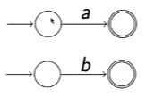

# Lecture 11: Regular Expressions

Compact notation for `describing regular languages`.

Similar to "regexes" in Javascript and Python

__`Example:`__ $(0 \cup 1) (0 \cup 1) ((0 \cup 1)(0 \cup 1))^*$ descibes strings whos lengths are a positive multiple of 2.

## Formal Syntax

The `regular expressions` over an alphabet $\Sigma = {a_1, ..., a_n}$ are given by the grammar:

$$
\begin{array}{lcl}
\text{regexp} \rightarrow a_1 |\\\\
...|\\\\
 a_n |\\\\
  \epsilon |\\\\
   \emptyset |\\\\
    \text{regexp} \cup \text{regexp} |\\\\
     (\text{regexp} \circ \text{regexp}) |\\\\
      (\text{regexp}^*)
\end{array}
$$

### Semantics:

$$
\begin{array}{lcl}
L(a) & = & \{a\}\\ \\
L(\epsilon) & = & \{\epsilon\} \\ \\
L(\emptyset) & = & \emptyset \\ \\
L(R_1 \cup R_2) & = & L(R_1) \cup L(R_2) \\ \\
L(R_1 \space R_2) & = & L(R_1) \circ L(R_2) \\ \\
L(R^*) & = & L(R)^*
\end{array}
$$

> [!NOTE]
> $L()$ denotes the "language"

## Notational Conveniences

We can ommit $\circ$ and sometimes parentheses.

Binding precedence: 
$$
\text{star} > \text{concatenation} > \text{union} \\
* > \circ > \cup
$$

### Examples:
1. $ab$ means $(a \circ b)$
2. $ab^*$ means $(a \circ (b^*))$
3. $a \cup bc^*$ means $(a \cup (b \circ (c ^ *)))$

## Regular Expressions - Examples

$$
\begin{array}{lcl}
\epsilon & : & \{\epsilon\} \\ \\
1 & : & \{1\} \\ \\
110 & : & \{110\} \\ \\
((0 \cup 1) (0 \cup 1))^* & : & \text{all binary strings of even length} \\ \\
(0 \cup \epsilon) (\epsilon \cup 1) & : & \{\epsilon, 0, 1, 01\} \\ \\
1^* & : & \text{all finite sequences of 1s} \\ \\
\epsilon \cup 1 \cup (\epsilon \cup 1) ^ * (\epsilon \cup 1) & : & \text{all finite sequences of 1s} \\ \\
(1^*0^*) & : & 
\end{array}
$$

## Regular Expressions to NFAs

> [!IMPORTANT]
> A language is regular iff it can be described by a regular expression.

To construct NFA from regular expression $R$. Use `structural induction`.

`Base cases:` $R = a \in \Sigma, R = \epsilon, \text{or} R = \emptyset$

`Inductive step:` $R = R_1 \cup R_2, R = R_1 \circ R_2, \text{or} R = R_1^*$. Use the constructions for closure under regular operations.

## Regular Expressions to NFAs: Example

Convert $(a \cup b) ^ * bc$ to an NFA.

Start from innermost expressions and work out:

So an NFA for $a \cup b$ is:

Use star construction to get NFA for $(a \cup b)^*$:

Finally, for $(a \cup b)^* bc$, we get:

## NFAs to Regular Expressions:

Reverse the construction; convert small pieces of NFA into matching regular expressions.

Represent using `generalised NFAs` (GNFAs), which allow labeling arrows with `regular expressions`.

The process produces either 

We get $(R_1 \cup R_2 R_3 ^* R_4) ^* R_2 R_3^*$ in the first case; $R^*$ in the second.

> [!NOTE]
> Some $R$s may be $\epsilon$ or $\emptyset$.
>
> Prove correctness by induction on the number of states.

## NFAS to Regular Expressions: Sketch

First make sure there is only one accept state. Construction:

Next, we eliminate states that are neither start nor accept states.

`In general`: If there are $m$ incoming and $n$ outgoing arrows, replace them with $mn$ bypassing arrows.

Let us illustrate the process on this example:

## State Elimination Example:

Create a single accept state:

Eliminate $D$ (and use regular expressions with all arcs):

Now eliminate $B$:

and then $C$:

> [!IMPORTANT]
> We still need an `empty set transition`

Note that:

with

$$
\begin{array}{lcl}
R_1 = 0 \cup 1 \\ \\
R_2 = 1(0 \cup 1)(\epsilon \cup 0 \cup 1) \\ \\
R_3 = R_4 = \emptyset
\end{array}
$$

Hence the instance of teh general "recipe" $(R_1 \cup R_2R_3^*R_4)^* R_2 R_3^*$ is:

$$
(0 \cup 1)^* 1 (0 \cup 1) (\epsilon \cup 0 \cup 1)
$$

## Some Useful Laws for Regular Expressions

$A = L(A), B = L(B)$ so on and so forth

$$
\begin{array}{lcl}
A \cup A \equiv A \\ \\
A \cup B \equiv B \cup A \\ \\
(A \cup B) \cup C \equiv A \cup (B \cup C) \equiv A \cup B \cup C \\ \\
(A \circ B) \circ C \equiv A \circ (B \circ C) \equiv A \circ B \circ C \\ \\
\emptyset \cup A \equiv A \cup \emptyset \equiv A \\ \\
\epsilon \circ A \equiv A \circ \epsilon \equiv A \\ \\
\emptyset \circ A \equiv A \circ \emptyset \equiv \emptyset \\ \\
(A \cup B) \circ C \equiv (A \circ C) \cup (B \circ C) \\ \\
A \circ (B \cup C) \equiv (A \circ B) \cup (A \circ C) \\ \\
(A^*)^* \equiv A^* \\ \\
\emptyset^* \equiv \epsilon ^ * \equiv \epsilon \\ \\
(\epsilon \cup A)^* \equiv A^* \\ \\
(A \cup B)^* \equiv (A^*B^*)^*
\end{array}
$$

## Limitations of Finite-State Automata

Consider the language:

$$
\{0^n1^n \space | \space n \geq 0\} = \{\epsilon, 01, 0011, 000111, ...\}
$$

> [!IMPORTANT]
> Intuitively we cannot build a DFA to recognise this language, because a `DFA has no memory of its actions so far`.
>
> It only knows it's `current state`.

