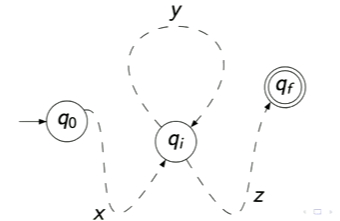

# Lecture 12:

## The Pumping Lemma for Regular Languages

### Lemma

If $A$ is a regular language over $\Sigma$, then there is some integer $p$ such that , for all $s \in A$ of length at least $p$, there exist $x, y, z \in \Sigma ^*$ such that $s = xyz$ and:
1. $xy^iz \in A$ for all $i \geq 0$, and
2. $|y| > 0$, and
3. $|xy| \leq p$.

---

This is the standard tool for `proving languages are non-regular`.

Loosly, it says that if we have a regular language $A$ and consider a sufficiently long string $s \in A$, then a recogniser for $A$ must traverse some `loop` to accept $s$. So $A$ must contain infinitely many strings exhibiting repetition of some substring in $s$.

## Intuition for the Pumping Lemma

### Pigeonhole Principle:

If you put $p$ pigeons into fewer than $p$ holes, some hole has more than one pigeon.

---

If a DFA has $p$ states, and you run it on a string longer than $p$ symbols, `it must enter the same state twice`.

> [!NOTE]
> Therefore it passes through a `cycle` in the graph!

## Tools for the Proof

Let $M = (Q, \Sigma, \delta, q_0, F)$ be a DFA.

### Definition:

Let $\hat{\delta} : Q \times \Sigma ^* \rightarrow Q$ such that for all $q \in Q, s \in \Sigma ^ *$ and $a \in \Sigma$,

$$
\begin{array}{lcl}
\hat{\delta}(q, \epsilon) = q,\\ \\
\hat{\delta} (q, as) = \hat{\delta}(\delta(q, a), s).
\end{array}
$$

---

### Lemma

$M$ accepts a string $s$ if and only if $\hat{\delta}(q_0, s) \in F$.

---

### Lemma

For all $q \in Q$ and $x, y \in \Sigma^*$,

$$
\hat{\delta}(q, xy) = \hat{\delta}(\hat{delta}(q, x), y).
$$

---

### Claim

If $L$ is regular then there exists a $p$ such that for all $s \in L$, if $|s| \geq p$, then there exists $x, y, z \in \Sigma^*$ such that $s = x y z$, and
1. $x y z \in L$ for all $i \geq 0$
2. $|y| > 0$
3. $|xy| \leq p$.

### Proof:

Let $M = (Q, \Sigma, \delta, q_0, F)$ be a DFA for $L$.

Let $p = |Q|$.

Let $s \in L$ such that $|s| \geq p$.

Let $n = |s|$. Then $s = a_1, ..., a_n$ where each $a_i \in \Z$.

Let $r_i = \hat{\delta}(q_0, a_1, ...m a_i)$ for all $i$ from $1$ to $n$.

Let $r_0 = q_0$. Since the sequence $r_i$ has $n+1$ elements and $n+1 > |Q|$, we have $rj = r_k$ for some indices $j < k$.

Let $x = a_1, ..., a_j$, $y = a_{j+1}, ..., a_{n}$. (If $k + 1 > n$, then $z = \epsilon$)

$$
\begin{array}{lcl}
|xy|\\ \\
= |x| + |y| \\ \\
= j + (k - (j + 1) + 1) \\ \\
= k\\ \\
k \leq p
\end{array}
$$

### Claim:

For all $i \geq 1$, $\hat{\delta}(q_0, xy^i) = \hat{\delta}(q_0, x)$

> [!NOTE]
>
> $y^i$ means $i$ copies of $y$

#### Base Case $(i = 1)$:

Show $\hat{\delta}(q_0, xy) = \hat{\delta}(q_0, x)$.

$$
\hat{\delta}(\hat{\delta}(q_0, x), y) = \hat{\delta}(q_0, xy)
$$

Let $q = \hat{\delta}(q_0, x)$.

By definition $r_j = \hat{\delta}(q_0, x)$ and $\hat{\delta}(q_0, xy) = r_k$

Because:

$$
\begin{array}{lcl}
x = a_1, ..., a_j\\ \\
xy = a_1, ..., a_k
\end{array}
$$

Since $r_j = r_k$, we have the base case as desired.

#### Inductive Step:

Suppose $\hat{\delta}(q_0, xy^m) = \hat{\delta}(q_0, x)$ for some $m \geq 1$.

Then, $\hat{\delta}(q_0, xy^{m+1})$

$$
\begin{array}{lcl}
= \hat{\delta}(\hat{\delta}(q_0, xy^m), y) & \text{By lemma from slides}\\ \\
= \hat{\delta}(\hat{\delta}(q_0, x), y) & \text{By inductive hypothesis} \\ \\
= \hat{\delta}(q_0, x y) & \text{By lemma from slides} \\ \\
= \hat{\delta}(q_0, x) & \text{By base case} \\ \\
\end{array}
$$

`By induction, the claim holds`

Since $s \in L$, we have $\hat{\delta}(q_0, s) \in F$. So we also have $\hat{\delta}(q_0. xyz) \in F$.